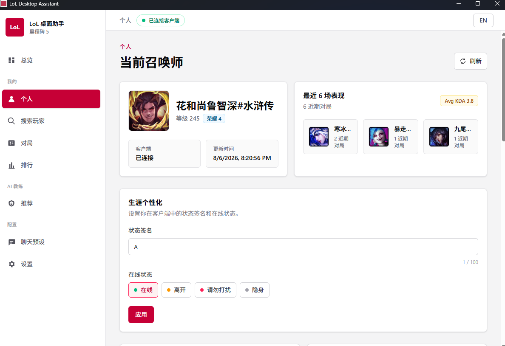
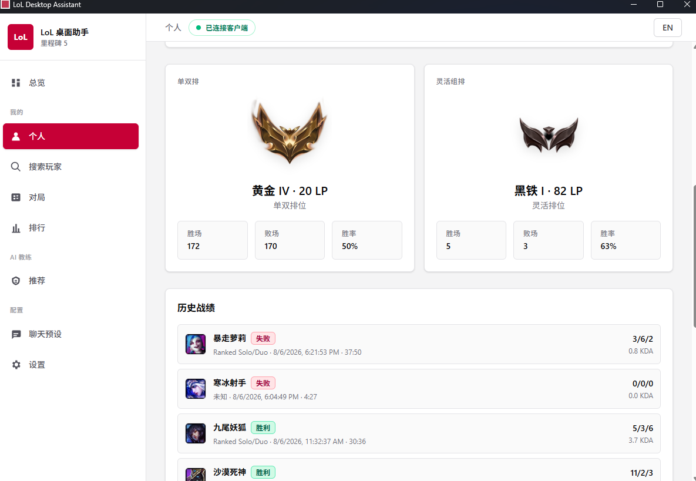
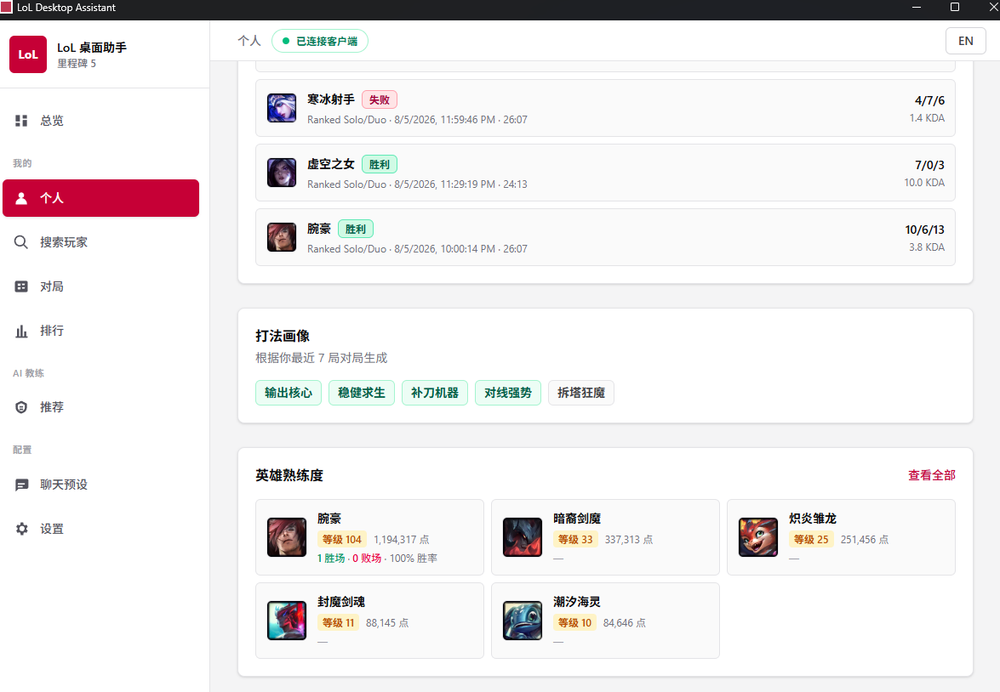
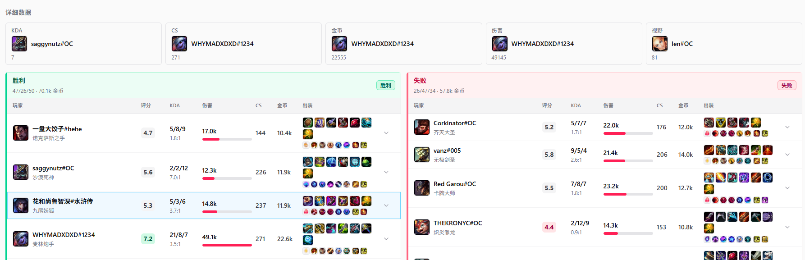
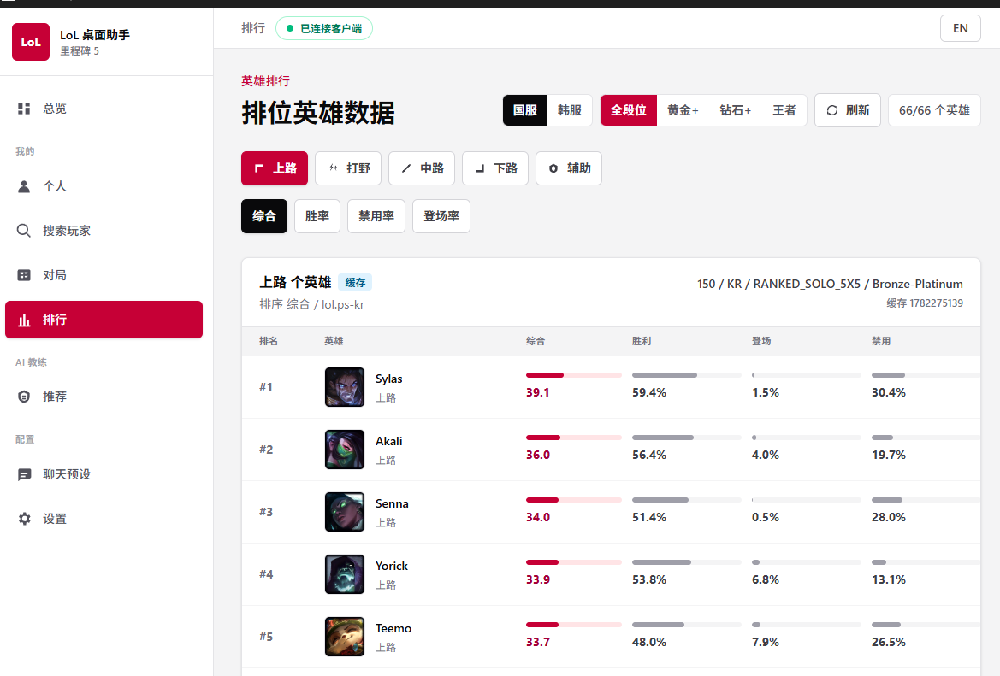
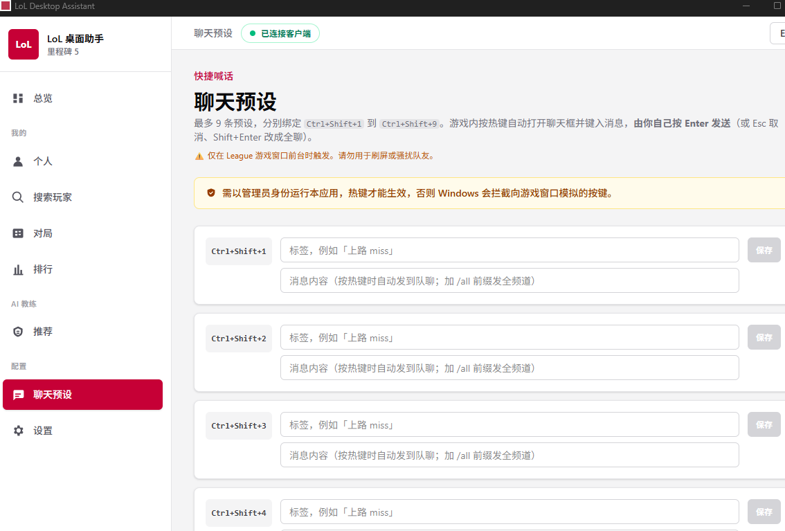
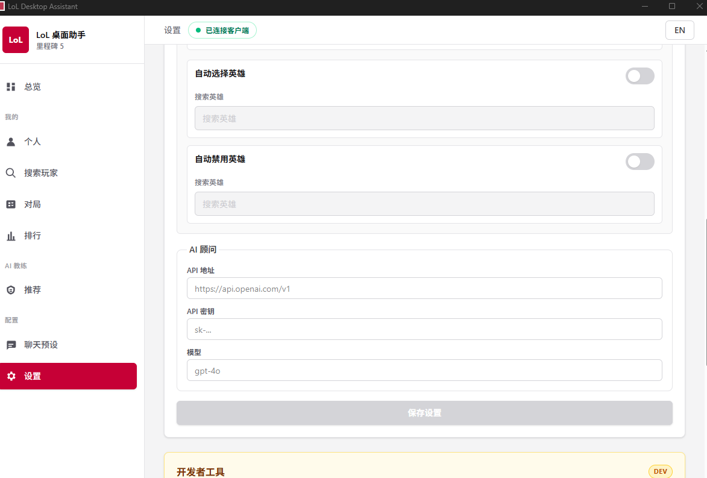

# LoL Desktop Assistant

> 🎮 Tauri-powered League of Legends desktop companion · AI Coach / Chat Presets / Match Analysis / Auto-Accept · 100% Local

[](https://github.com/Giggitycountless/LOL-Desktop-Assistant/releases)


🌐 **[Landing Page](https://giggitycountless.github.io/LOL-AI-Intelligence/)** · [中文文档](README_CN.md) · [Promotion Copy](docs/promotion-copy.md)

---

## 📥 Download

**[👉 Latest Release](https://github.com/Giggitycountless/LOL-Desktop-Assistant/releases/latest)**

Download `LoL Desktop Assistant_x.y.z_x64-setup.exe`, double-click to install. **Windows 10 / 11 x64** only.

> Chat presets require **Run as Administrator** (Windows UIPI restriction). Other features work with normal user permissions.

---

## 📸 Screenshots

<table>
<tr>
<td width="50%">

**Summoner Overview** — client status, recent games at a glance


</td>
<td width="50%">

**Ranked Stats & Match History** — Solo/Duo & Flex rank, recent games


</td>
</tr>
<tr>
<td width="50%">

**Playstyle & Champion Mastery** — AI-generated playstyle tags from recent games


</td>
<td width="50%">

**Post-Game Review** — full scoreboard with damage, gold, items for both teams


</td>
</tr>
<tr>
<td width="50%">

**Champion Tier List** — win rate / pick rate / ban rate by role and rank


</td>
<td width="50%">

**Chat Presets** — 9 hotkey-bound messages, `Ctrl+Shift+1` ~ `Ctrl+Shift+9`


</td>
</tr>
<tr>
<td width="50%">

**Settings** — auto pick/ban, AI advisor API config


</td>
<td width="50%">

</td>
</tr>
</table>

---

## ✨ Features

### 🤖 AI Coach
- **Data Analysis**: Analyzes your last ~100 ranked games (Solo/Duo + Flex), identifies strengths & weaknesses, filterable by role (Top / Jungle / Mid / Bot / Support)
- **Post-Game Review**: In-depth single-game analysis — team comps, damage breakdown, vision, economy, all dimensions compared
- **Three Styles**: Objective analysis / Ruthless roast / Professional praise (switchable)
- Compatible with any **OpenAI-format API**: OpenAI, DeepSeek, Qwen, Moonshot, etc.

### 💬 Chat Presets
- 9 preset messages bound to `Ctrl+Shift+1` ~ `Ctrl+Shift+9`
- Press hotkey in-game to auto-open chat and type the message (**Chinese supported**)
- You press `Enter` to send (editable, `Esc` to cancel, `Shift+Enter` for /all)

### 🛎️ Automation
- Auto-accept queue (configurable delay)
- Auto-pick / auto-ban by role preference
- Auto-apply Tencent recommended rune page on lock-in

### 👁️ In-Game Overlay
- Auto-shows 10-player stats panel on game start (KDA, recent win rate, Scout Score)
- `Shift+Tab` to toggle show/hide

### 📊 Match History
- Recent match list + detailed scoreboard + AI review window

---

## 🔒 Data & Privacy

- All data stored in local SQLite (`%APPDATA%/com.local.lol-desktop-assistant`)
- Only accesses your local League Client (LCU) — **no Riot API calls, no data uploads**
- AI features use YOUR API key; requests go to YOUR configured endpoint, never through any third party

---

## ⚠️ Known Limitations

- **Windows only** (macOS / Linux don't have a League client)
- **Chat presets require admin rights**: otherwise Windows UIPI blocks synthetic keystrokes to the League window
- **CN server Vanguard may flag synthetic input**: this only types for you and doesn't affect game mechanics, but use at your own risk
- **Unsigned installer**: Windows SmartScreen will warn — click "Run anyway"

---

## 🛠️ Built With

- [Rust](https://www.rust-lang.org/) — backend
- [Tauri 2](https://tauri.app/) — desktop framework (WebView2 + Rust binary on Windows)
- [React 19](https://react.dev/) + [TypeScript 5.9](https://www.typescriptlang.org/) — frontend
- [Vite 8](https://vitejs.dev/) — frontend build
- [Tailwind CSS 4](https://tailwindcss.com/) — styling
- [rusqlite](https://github.com/rusqlite/rusqlite) (bundled SQLite) — local storage

---

## 🧱 Development

### Prerequisites

- Node.js 20+ / npm
- Rust stable MSVC toolchain
- Microsoft C++ Build Tools / Visual Studio Build Tools
- WebView2 Runtime (included in Windows 11)

### Commands

```powershell
npm install                  # install frontend deps
npm run dev                  # dev mode (Vite HMR + Rust backend)
npm run build                # build release installer to target/release/bundle/nsis/
npm run typecheck            # TS type check
cargo check --workspace      # Rust compile check
cargo test --workspace       # all Rust tests
```

### Project Structure

```text
.
├─ crates/
│  ├─ domain/       # shared DTOs, enums, pure model types
│  ├─ application/  # use cases, validation, command orchestration
│  ├─ adapters/     # local LCU adapter, external data sources
│  ├─ storage/      # SQLite connection, migrations, settings, activity, notes
│  └─ platform/     # Tauri command boundary, AppState, command DTOs
├─ src-tauri/       # Tauri executable shell + Windows packaging config
└─ src/
   ├─ backend/      # typed TS wrappers around Tauri commands
   ├─ components/   # reusable React components
   ├─ pages/        # Dashboard / Profile / Matches / Advisor / ChatPresets / ...
   ├─ state/        # AppStateProvider + frontend state boundary
   └─ windows/      # Tauri sub-window helpers
```

### Architecture Layers

- **Domain** — no external crate dependencies
- **Application** — validation and business logic
- **Storage** — owns SQLite and migrations
- **Adapters** — owns external / local client integration details
- **Platform** — owns Tauri commands and command DTOs
- **Frontend** — only calls backend command wrappers; no business logic

See [`CONTEXT.md`](./CONTEXT.md) for domain terminology.

### Publishing a Release

```powershell
npm run build
gh release create v0.x.0 "target/release/bundle/nsis/LoL Desktop Assistant_0.x.0_x64-setup.exe" `
  --title "v0.x.0" --notes-file release-notes.md
```

---

## 📄 License

[AGPL-3.0-or-later](./LICENSE)

You're free to use, modify, and distribute. **If you distribute a modified version (including as a network service)**, you must open-source your changes under the same AGPL license.
